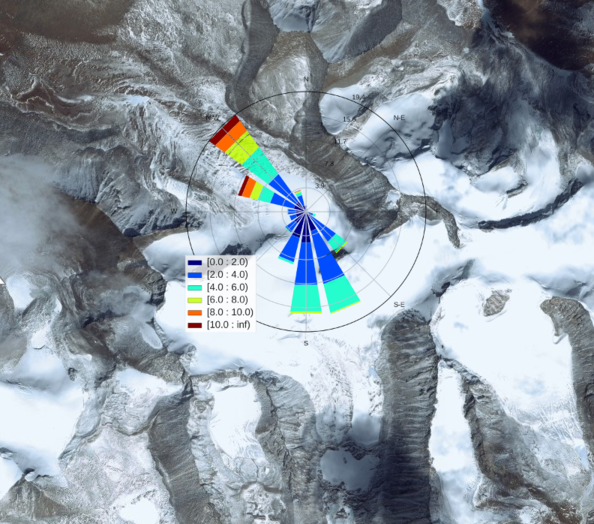
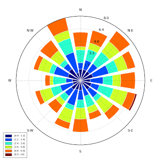
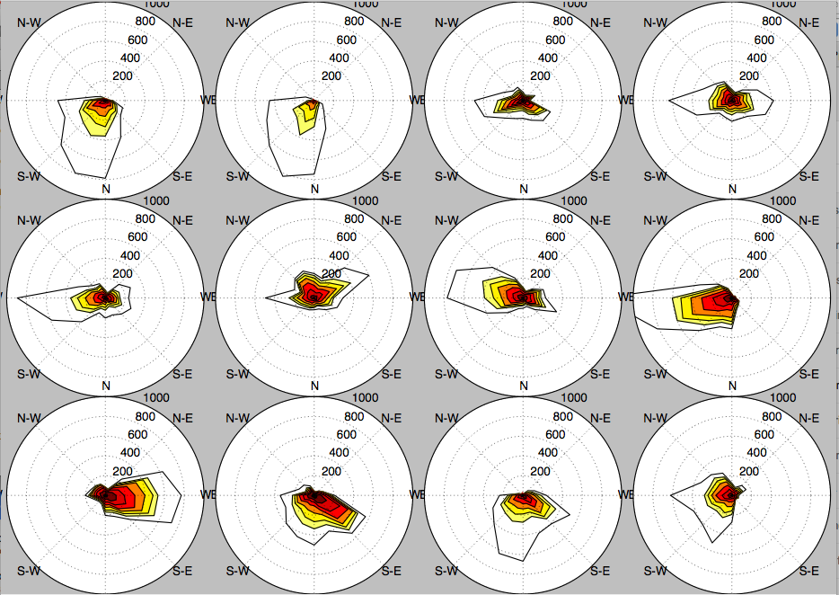
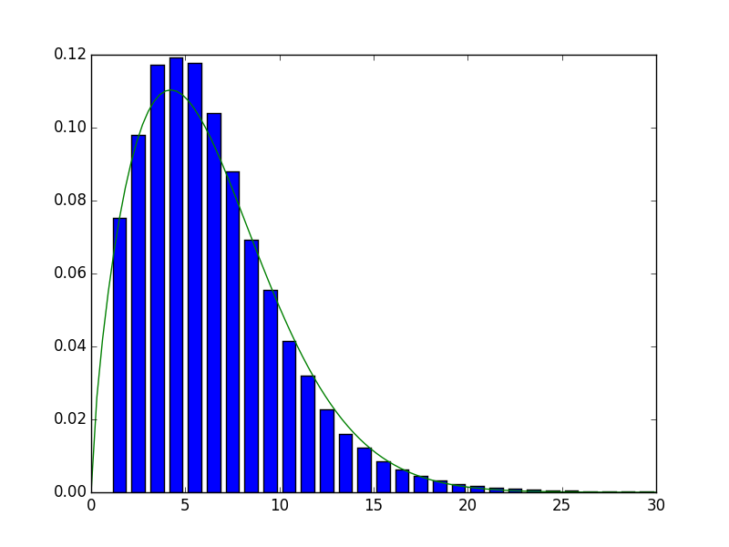

[](http://windrose.readthedocs.io/en/latest/?badge=latest)
[](https://pypi.python.org/pypi/windrose/)
[](https://pypi.python.org/pypi/windrose/)
[](https://pypi.python.org/pypi/windrose/)
[](https://pypi.python.org/pypi/windrose/)
[](https://pypi.python.org/pypi/windrose/)
[](https://requires.io/github/python-windrose/windrose/requirements/?branch=master)
[](https://landscape.io/github/python-windrose/windrose/master)
[](https://www.codacy.com/project/s-celles/windrose_2/dashboard?utm_source=github.com&amp;utm_medium=referral&amp;utm_content=python-windrose/windrose&amp;utm_campaign=Badge_Grade_Dashboard)
[](https://travis-ci.org/python-windrose/windrose)
[](https://zenodo.org/badge/latestdoi/37549137)
[](https://doi.org/10.21105/joss.00268)

# Windrose

A [wind rose](https://en.wikipedia.org/wiki/Wind_rose) is a graphic tool used by meteorologists to give a succinct view of how wind speed and direction are typically distributed at a particular location. It can also be used to describe air quality pollution sources. The wind rose tool uses Matplotlib as a backend. Data can be passed to the package using Numpy arrays or a Pandas DataFrame.

Windrose is a Python library to manage wind data, draw windroses (also known as polar rose plots), and fit Weibull probability density functions.

The initial use case of this library was for a technical report concerning pollution exposure and wind distributions analyzes. Data from local pollution measures and meteorologic informations from various sources like Meteo-France were used to generate a pollution source wind rose.

It is also used by some contributors for teaching purpose.



Some others contributors have used it to make figures for a [wind power plant control optimization study](https://www.nrel.gov/docs/fy17osti/68185.pdf).

Some academics use it to track lightning strikes during high intensity storms. They are using it to visualize the motion of storms based on the relative position of the lightning from one strike to the next.

## Install

### Requirements

- matplotlib http://matplotlib.org/
- numpy http://www.numpy.org/
- and naturally python https://www.python.org/ :-P

Option libraries:

- Pandas http://pandas.pydata.org/ (to feed plot functions easily)
- Scipy http://www.scipy.org/ (to fit data with Weibull distribution)
- ffmpeg https://www.ffmpeg.org/ (to output video)
- click http://click.pocoo.org/ (for command line interface tools)

### Install latest release version via pip

A package is available and can be downloaded from PyPi and installed using:

```bash
$ pip install windrose
```

### Install latest development version

```bash
$ pip install git+https://github.com/python-windrose/windrose
```

or

```bash
$ git clone https://github.com/python-windrose/windrose
$ python setup.py install
```

## Examples

Let's generate random data for wind speed (`ws`) and wind direction (`wd`).

```python
from windrose import WindroseAxes
from matplotlib import pyplot as plt
import matplotlib.cm as cm
import numpy as np

# Create wind speed and direction variables

ws = np.random.random(500) * 6
wd = np.random.random(500) * 360
```

The bar plot wind rose is the most common plot

-

This kind of plot can be plot using:

```python
ax = WindroseAxes.from_ax()
ax.bar(wd, ws, normed=True, opening=0.8, edgecolor='white')
ax.set_legend()
```

Contour plots are also possible

-

Several windroses can be plotted using subplots to provide a plot per year with for example subplots per month

-

Probability density functions may be plotted. Fitting Weibull distribution is enabled by Scipy.
The Weibull distribution is used in weather forecasting and the wind power industry to describe wind speed distributions, as the natural distribution of wind speeds often matches the Weibull shape

-

## Documentation
[](http://windrose.readthedocs.io/en/latest/?badge=latest)
Full documentation of library is available at http://windrose.readthedocs.io/

## Community guidelines

You can help to develop this library.

### Code of Conduct

If you are using Python Windrose and want to interact with developers, others users...
we encourage you to follow our [code of conduct](https://github.com/python-windrose/windrose/blob/master/CODE_OF_CONDUCT.md).

### Contributing

If you discover issues, have ideas for improvements or new features, please report them.
[CONTRIBUTING.md](https://github.com/python-windrose/windrose/blob/master/CONTRIBUTING.md) explains
how to contribute to this project.

### List of contributors and/or notable users
https://github.com/python-windrose/windrose/blob/master/CONTRIBUTORS.md
