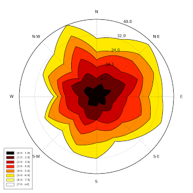
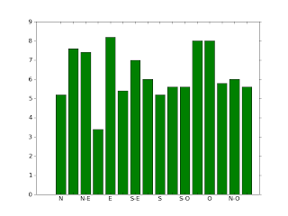

[](https://pypi.python.org/pypi/windrose/)
[](https://pypi.python.org/pypi/windrose/)
[](https://pypi.python.org/pypi/windrose/)
[](https://pypi.python.org/pypi/windrose/)
[](https://pypi.python.org/pypi/windrose/)
[](https://pypi.python.org/pypi/windrose/)
[](https://requires.io/github/scls19fr/windrose/requirements/?branch=master)
[](https://landscape.io/github/scls19fr/windrose/master)
[](https://www.codacy.com/app/s-celles/windrose)
[](https://travis-ci.org/scls19fr/windrose)


#windrose

A windrose, also known as a polar rose plot, is a special diagram for representing the distribution of meteorological datas, typically wind speeds by class and direction.
This is a simple module for the matplotlib python library, which requires numpy for internal computation.

Original code forked from:
 - windrose 1.4 by [Lionel Roubeyrie](https://github.com/LionelR) <lionel.roubeyrie@gmail.com> http://youarealegend.blogspot.fr/search/label/windrose


##Requirements:

 - matplotlib http://matplotlib.org/
 - numpy http://www.numpy.org/
 - and naturally python https://www.python.org/ :-P

Option libraries:

 - Pandas http://pandas.pydata.org/ (to feed plot functions easily)
 - Scipy http://www.scipy.org/ (to fit data with Weibull distribution)
 - ffmpeg https://www.ffmpeg.org/ (to output video)
 - click http://click.pocoo.org/ (for command line interface tools)

## Install

A package is available and can be downloaded from PyPi and installed using:

```bash
$ pip install windrose
```

##Notebook example :

An [IPython (Jupyter)](http://ipython.org/) notebook showing this package usage is available at:

 - http://nbviewer.ipython.org/github/scls19fr/windrose/blob/master/windrose_sample_random.ipynb

##Script example :

This example use randoms values for wind speed and direction(ws and wd variables). In situation, these variables are loaded with reals values (1-D array), from a database or directly from a text file (see the "load" facility from the matplotlib.pylab interface for that).

```python
from windrose import WindroseAxes
from matplotlib import pyplot as plt
import matplotlib.cm as cm
import numpy as np

# Create wind speed and direction variables

ws = np.random.random(500) * 6
wd = np.random.random(500) * 360
```

###A stacked histogram with normed (displayed in percent) results :

```python
ax = WindroseAxes.from_ax()
ax.bar(wd, ws, normed=True, opening=0.8, edgecolor='white')
ax.set_legend()
```


###Another stacked histogram representation, not normed, with bins limits

```python
ax = WindroseAxes.from_ax()
ax.box(wd, ws, bins=np.arange(0, 8, 1))
ax.set_legend()
```


###A windrose in filled representation, with a controled colormap

```python
ax = WindroseAxes.from_ax()
ax.contourf(wd, ws, bins=np.arange(0, 8, 1), cmap=cm.hot)
ax.set_legend()
```


###Same as above, but with contours over each filled region...

```python
ax = WindroseAxes.from_ax()
ax.contourf(wd, ws, bins=np.arange(0, 8, 1), cmap=cm.hot)
ax.contour(wd, ws, bins=np.arange(0, 8, 1), colors='black')
ax.set_legend()
```



###...or without filled regions

```python
ax = WindroseAxes.from_ax()
ax.contour(wd, ws, bins=np.arange(0, 8, 1), cmap=cm.hot, lw=3)
ax.set_legend()
```


After that, you can have a look at the computed values used to plot the windrose with the `ax._info` dictionnary :
 - `ax._info['bins']` : list of bins (limits) used for wind speeds. If not set in the call, bins will be set to 6 parts between wind speed min and max.
 - `ax._info['dir']` : list of directions "bundaries" used to compute the distribution by wind direction sector. This can be set by the nsector parameter (see below).
 - `ax._info['table']` : the resulting table of the computation. It's a 2D histogram, where each line represents a wind speed class, and each column represents a wind direction class.


So, to know the frequency of each wind direction, for all wind speeds, do:

```python
ax.bar(wd, ws, normed=True, nsector=16)
table = ax._info['table']
wd_freq = np.sum(table, axis=0)
```

and to have a graphical representation of this result :

```python
direction = ax._info['dir']
wd_freq = np.sum(table, axis=0)
plt.bar(np.arange(16), wd_freq, align='center')
xlabels = ('N','','N-E','','E','','S-E','','S','','S-O','','O','','N-O','')
xticks=arange(16)
gca().set_xticks(xticks)
draw()
gca().set_xticklabels(xlabels)
draw()
```



In addition of all the standard pyplot parameters, you can pass special parameters to control the windrose production. For the stacked histogram windrose, calling help(ax.bar) will give :
`bar(self, direction, var, **kwargs)` method of `windrose.WindroseAxes` instance Plot a windrose in bar mode. For each var bins and for each sector, a colored bar will be draw on the axes.
 

Mandatory:
 - `direction` : 1D array - directions the wind blows from, North centred
 - `var` : 1D array - values of the variable to compute. Typically the wind speeds

Optional:
 - `nsector` : integer - number of sectors used to compute the windrose table. If not set, nsectors=16, then each sector will be 360/16=22.5°, and the resulting computed table will be aligned with the cardinals points.
 - `bins` : 1D array or integer- number of bins, or a sequence of bins variable. If not set, bins=6 between min(var) and max(var).
 - `blowto` : bool. If True, the windrose will be pi rotated, to show where the wind blow to (usefull for pollutant rose).
 - `colors` : string or tuple - one string color (`'k'` or `'black'`), in this case all bins will be plotted in this color; a tuple of matplotlib color args (string, float, rgb, etc), different levels will be plotted in different colors in the order specified.
 - `cmap` : a cm Colormap instance from `matplotlib.cm`.
   - if `cmap == None` and `colors == None`, a default Colormap is used.
 - `edgecolor` : string - The string color each edge bar will be plotted.
   Default : no edgecolor
 - `opening` : float - between 0.0 and 1.0, to control the space between each sector (1.0 for no space)

###probability density function (pdf) and fitting Weibull distribution

A probability density function can be plot using:

```python
from windrose import WindAxes
ax = WindAxes.from_ax()
bins = np.arange(0, 6 + 1, 0.5)
bins = bins[1:]
ax, params = ax.pdf(ws, bins=bins)
```


Optimal parameters of Weibull distribution can be displayed using

```python
print(params)
(1, 1.7042156870194352, 0, 7.0907180300605459)
```


##Functional API

Instead of using object oriented approach like previously shown, some "shortcut" functions have been defined: `wrbox`, `wrbar`, `wrcontour`, `wrcontourf`, `wrpdf`.
See [unit tests](tests/test_windrose.py).

##Pandas support

windrose not only supports Numpy arrays. It also supports also Pandas DataFrame. `plot_windrose` function provides most of plotting features previously shown.


```python
from windrose import plot_windrose
N = 500
ws = np.random.random(N) * 6
wd = np.random.random(N) * 360
df = pd.DataFrame({'speed': ws, 'direction': wd})
plot_windrose(df, kind='contour', bins=np.arange(0.01,8,1), cmap=cm.hot, lw=3)
```

Mandatory:
 - `df`: Pandas DataFrame with `DateTimeIndex` as index and at least 2 columns (`'speed'` and `'direction'`).

Optional:
 - `kind` : kind of plot (might be either, `'contour'`, `'contourf'`, `'bar'`, `'box'`, `'pdf'`)
 - `var_name` : name of var column name ; default value is `VAR_DEFAULT='speed'`
 - `direction_name` : name of direction column name ; default value is `DIR_DEFAULT='direction'`
 - `clean_flag` : cleanup data flag (remove data points with `NaN`, `var=0`) before plotting ; default value is `True`.

##Video export
A video of plots can be exported. See:

[](https://www.youtube.com/watch?v=0u2RxtGgEFo)
[](https://www.youtube.com/watch?v=3CWpjSEt0so)
[](https://www.youtube.com/watch?v=UiGC-3aw9TM)

[Source code](samples/example_animate.py)

This is just a sample for now. API for video need to be created.

Use: 

```bash
$ python samples/example_animate.py --help
```

to display command line interface usage.

## Development

You can help to develop this library.

### Issues

You can submit issues using <https://github.com/scls19fr/windrose/issues>

### Clone

You can clone repository to try to fix issues yourself using:

```bash
$ git clone https://github.com/scls19fr/windrose.git
```

### Run unit tests

Run all unit tests

```bash
$ nosetests -s -v
```
	
Run a given test

```bash
$ nosetests tests.test_windrose:test_plot_by -s -v
```

### Install development version

```bash
$ python setup.py install
```
	
or

```bash
$ sudo pip install git+https://github.com/scls19fr/windrose.git
```

### Collaborating

- Fork repository
- Create a branch which fix a given issue
- Submit pull requests

<https://help.github.com/categories/collaborating/>
