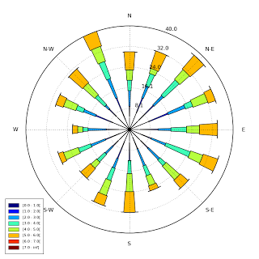
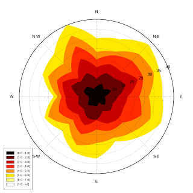
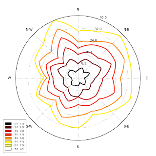
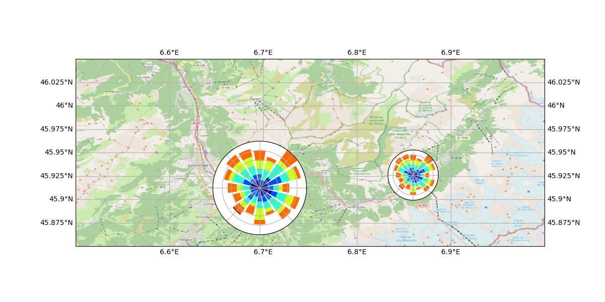

Notebook example
----------------

An `IPython (Jupyter) <http://ipython.org/>`__ notebook showing this
package usage is available at:

-  http://nbviewer.ipython.org/github/python-windrose/windrose/blob/master/windrose_sample_random.ipynb

Script example
--------------

This example use randoms values for wind speed and direction(ws and wd
variables). In situation, these variables are loaded with reals values
(1-D array), from a database or directly from a text file (see the
"load" facility from the matplotlib.pylab interface for that).

.. code:: python

    from windrose import WindroseAxes
    from matplotlib import pyplot as plt
    import matplotlib.cm as cm
    import numpy as np

    # Create wind speed and direction variables

    ws = np.random.random(500) * 6
    wd = np.random.random(500) * 360

A stacked histogram with normed (displayed in percent) results
~~~~~~~~~~~~~~~~~~~~~~~~~~~~~~~~~~~~~~~~~~~~~~~~~~~~~~~~~~~~~~

.. code:: python

    ax = WindroseAxes.from_ax()
    ax.bar(wd, ws, normed=True, opening=0.8, edgecolor='white')
    ax.set_legend()

.. figure:: screenshots/bar.png
   :alt: bar

Another stacked histogram representation, not normed, with bins limits
~~~~~~~~~~~~~~~~~~~~~~~~~~~~~~~~~~~~~~~~~~~~~~~~~~~~~~~~~~~~~~~~~~~~~~

.. code:: python

    ax = WindroseAxes.from_ax()
    ax.box(wd, ws, bins=np.arange(0, 8, 1))
    ax.set_legend()

A windrose in filled representation, with a controled colormap
~~~~~~~~~~~~~~~~~~~~~~~~~~~~~~~~~~~~~~~~~~~~~~~~~~~~~~~~~~~~~~

.. code:: python

    ax = WindroseAxes.from_ax()
    ax.contourf(wd, ws, bins=np.arange(0, 8, 1), cmap=cm.hot)
    ax.set_legend()

Same as above, but with contours over each filled region...
~~~~~~~~~~~~~~~~~~~~~~~~~~~~~~~~~~~~~~~~~~~~~~~~~~~~~~~~~~~

.. code:: python

    ax = WindroseAxes.from_ax()
    ax.contourf(wd, ws, bins=np.arange(0, 8, 1), cmap=cm.hot)
    ax.contour(wd, ws, bins=np.arange(0, 8, 1), colors='black')
    ax.set_legend()

.. figure:: screenshots/contourf-contour.png
   :alt: contourf-contour

...or without filled regions
~~~~~~~~~~~~~~~~~~~~~~~~~~~~

.. code:: python

    ax = WindroseAxes.from_ax()
    ax.contour(wd, ws, bins=np.arange(0, 8, 1), cmap=cm.hot, lw=3)
    ax.set_legend()

After that, you can have a look at the computed values used to plot the
windrose with the ``ax._info`` dictionnary : 

- ``ax._info['bins']`` :
  list of bins (limits) used for wind speeds. If not set in the call, bins
  will be set to 6 parts between wind speed min and max. 
- ``ax._info['dir']`` : list of directions "bundaries" used to compute the
  distribution by wind direction sector. This can be set by the nsector
  parameter (see below). 
- ``ax._info['table']`` : the resulting table of
  the computation. It's a 2D histogram, where each line represents a wind
  speed class, and each column represents a wind direction class.

So, to know the frequency of each wind direction, for all wind speeds,
do:

.. code:: python

    ax.bar(wd, ws, normed=True, nsector=16)
    table = ax._info['table']
    wd_freq = np.sum(table, axis=0)

and to have a graphical representation of this result :

.. code:: python

    direction = ax._info['dir']
    wd_freq = np.sum(table, axis=0)
    plt.bar(np.arange(16), wd_freq, align='center')
    xlabels = ('N','','N-E','','E','','S-E','','S','','S-O','','O','','N-O','')
    xticks=arange(16)
    gca().set_xticks(xticks)
    draw()
    gca().set_xticklabels(xlabels)
    draw()

.. figure:: screenshots/histo_WD.png
   :alt: histo\_WD

In addition of all the standard pyplot parameters, you can pass special
parameters to control the windrose production. For the stacked histogram
windrose, calling help(ax.bar) will give :
``bar(self, direction, var, **kwargs)`` method of
``windrose.WindroseAxes`` instance Plot a windrose in bar mode. For each
var bins and for each sector, a colored bar will be draw on the axes.

Mandatory:

- ``direction`` : 1D array - directions the wind blows from, North centred
- ``var`` : 1D array - values of the variable to compute. Typically the wind speeds

Optional: 

- ``nsector`` : integer - number of sectors used to compute
  the windrose table. If not set, nsectors=16, then each sector will be
  360/16=22.5°, and the resulting computed table will be aligned with the
  cardinals points.
- ``bins`` : 1D array or integer - number of bins, or a
  sequence of bins variable. If not set, bins=6 between min(var) and
  max(var).
- ``blowto`` : bool. If True, the windrose will be pi rotated,
  to show where the wind blow to (usefull for pollutant rose). 
- ``colors`` : string or tuple - one string color (``'k'`` or
  ``'black'``), in this case all bins will be plotted in this color; a
  tuple of matplotlib color args (string, float, rgb, etc), different
  levels will be plotted in different colors in the order specified. 
- ``cmap`` : a cm Colormap instance from ``matplotlib.cm``. - if
  ``cmap == None`` and ``colors == None``, a default Colormap is used. 
- ``edgecolor`` : string - The string color each edge bar will be plotted.
  Default : no edgecolor 
- ``opening`` : float - between 0.0 and 1.0, to
  control the space between each sector (1.0 for no space) 
- ``mean_values`` : Bool - specify wind speed statistics with
  direction=specific mean wind speeds. If this flag is specified, var is
  expected to be an array of mean wind speeds corresponding to each entry
  in ``direction``. These are used to generate a distribution of wind
  speeds assuming the distribution is Weibull with shape factor = 2. 
- ``weibull_factors`` : Bool - specify wind speed statistics with
  direction=specific weibull scale and shape factors. If this flag is
  specified, var is expected to be of the form [[7,2], ...., [7.5,1.9]]
  where var[i][0] is the weibull scale factor and var[i][1] is the shape
  factor

probability density function (pdf) and fitting Weibull distribution
~~~~~~~~~~~~~~~~~~~~~~~~~~~~~~~~~~~~~~~~~~~~~~~~~~~~~~~~~~~~~~~~~~~

A probability density function can be plot using:

.. code:: python

    from windrose import WindAxes
    ax = WindAxes.from_ax()
    bins = np.arange(0, 6 + 1, 0.5)
    bins = bins[1:]
    ax, params = ax.pdf(ws, bins=bins)

.. figure:: screenshots/pdf.png
   :alt: pdf

Optimal parameters of Weibull distribution can be displayed using

Overlay of a map
~~~~~~~~~~~~~~~~

This example illustrate how to set an windrose axe on top of any other axes. Specifically,
overlaying a map is often usefull.

.. code:: python
   import numpy as np
   import matplotlib as mpl
   import matplotlib.pyplot as plt
   import cartopy.crs as ccrs
   import cartopy.io.img_tiles as cimgt

   import windrose

   def figposition2coordinate(x, y, ax):
       """Given a position in the figure, return the position lon/lat on the ax

       Parameters
       ==========

       x : float
           Position on the figure
       y : float
           Position on the figure
       ax : axes
           Axe on which we want to convert x/y in lon/lat

       Return
       ======

       lonlat : tuple
       """

       fig_coordinates = ax.figure.transFigure.transform((x, y))
       ax_inverted = ax.transData.inverted()
       lonlat = ax_inverted.transform((fig_coordinates[0], fig_coordinates[1]))
       return lonlat

   def coordinate2figposition(lon, lat, ax):
       """Given an ax, return the figure position of a lon and lat

       Parameters
       ==========

       lon : float
           The longitude of the point
       lat : float
           The latitude of the point
       ax : matplotlib.Axes
           The axe used as overlay

       Return
       ======

       xy : tuple
           The position of the lon and lat on the figure.
       """

       display_coordinate = ax.transData.transform((lon, lat))
       fig_inverted = ax.figure.transFigure.inverted()
       xy = fig_inverted.transform(display_coordinate)
       return xy

   def main():
       minlon, maxlon, minlat, maxlat = (6.5, 7.0, 45.85, 46.05)

       proj = ccrs.PlateCarree()
       fig = plt.figure()
       # Draw main ax on top of which we will add windroses
       main_ax = fig.add_subplot(1, 1, 1, projection=proj)
       main_ax.set_extent([minlon, maxlon, minlat, maxlat], crs=proj)
       main_ax.gridlines(draw_labels=True)
       main_ax.coastlines()

       request = cimgt.OSM()
       main_ax.add_image(request, 12)

       # Coordinates of the station we were measuring windspeed
       cham_lon, cham_lat = (6.8599, 45.9259)
       passy_lon, passy_lat = (6.7, 45.9159)

       # heigh of the plot in figure proportion
       height = 0.2

       x_cham, y_cham = coordinate2figposition(cham_lon, cham_lat, ax=main_ax)
       x_passy, y_passy = coordinate2figposition(passy_lon, passy_lat, ax=main_ax)

       ws = np.random.random(500) * 6
       wd = np.random.random(500) * 360

       wrax_cham = windrose.WindroseAxes.from_ax(
               fig=fig,
               rect=[x_cham-height/2, y_cham-height/2, height, height],
               )

       wrax_passy = windrose.WindroseAxes.from_ax(
               fig=fig,
               rect=[x_passy-height/2, y_passy-height/2, height, height],
               )

       wrax_cham.bar(wd, ws)
       wrax_cham.set_xticklabels("")
       wrax_passy.bar(wd, ws)
       wrax_passy.set_xticklabels("")

       # IMPORTANT! ===================================================================
       # Cartopy set the axis aspect to "equal", which dynamically change the x/y scale.
       # Since we fixed the position of the windrose as fraction of the figure, the position
       # may be wrong.
       # So we have to set the aspect to "auto". But the background will be scrappy
       #main_ax.set_aspect("auto")

       # If you don't resize the figure later on, you can also tweak the fig size to be
       # proportional of your lon/lat extent.
       ratio_fig_w_h = (maxlat-minlat)/(maxlon-minlon)
       fig_width = 10
       fig.set_size_inches(fig_width, fig_width*ratio_fig_w_h)

       return (main_ax, [wrax_cham, wrax_passy])

   main()

.. code:: python

    print(params)
    (1, 1.7042156870194352, 0, 7.0907180300605459)

Functional API
--------------

Instead of using object oriented approach like previously shown, some
"shortcut" functions have been defined: ``wrbox``, ``wrbar``,
``wrcontour``, ``wrcontourf``, ``wrpdf``. See `unit
tests <tests/test_windrose.py>`__.

Pandas support
--------------

windrose not only supports Numpy arrays. It also supports also Pandas
DataFrame. ``plot_windrose`` function provides most of plotting features
previously shown.

.. code:: python

    from windrose import plot_windrose
    N = 500
    ws = np.random.random(N) * 6
    wd = np.random.random(N) * 360
    df = pd.DataFrame({'speed': ws, 'direction': wd})
    plot_windrose(df, kind='contour', bins=np.arange(0.01,8,1), cmap=cm.hot, lw=3)

Mandatory:

- ``df``: Pandas DataFrame with ``DateTimeIndex`` as index
  and at least 2 columns (``'speed'`` and ``'direction'``).

Optional: 

- ``kind`` : kind of plot (might be either, ``'contour'``, ``'contourf'``, ``'bar'``, ``'box'``, ``'pdf'``)
- ``var_name`` : name of var column name ; default value is ``VAR_DEFAULT='speed'``
- ``direction_name`` : name of direction column name ; default value is
  ``DIR_DEFAULT='direction'``
- ``clean_flag`` : cleanup data flag (remove
  data points with ``NaN``, ``var=0``) before plotting ; default value is
  ``True``.

Subplots
--------

.. figure:: screenshots/subplots.png
   :alt: subplots

Video export
------------

A video of plots can be exported. A playlist of videos is available at
https://www.youtube.com/playlist?list=PLE9hIvV5BUzsQ4EPBDnJucgmmZ85D\_b-W

See:

|Video1| |Video2| |Video3|

`Source code <samples/example_animate.py>`__

This is just a sample for now. API for video need to be created.

Use:

.. code:: bash

    $ python samples/example_animate.py --help

to display command line interface usage.
