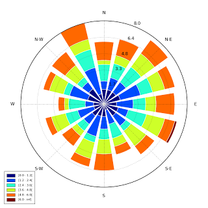
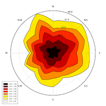
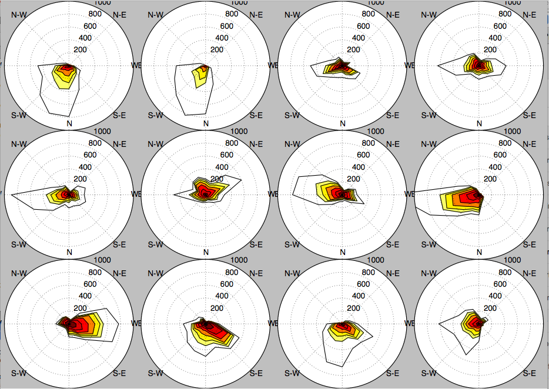
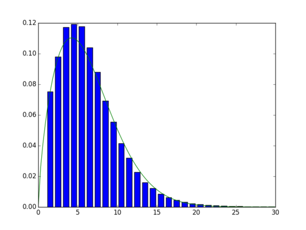

# Summary

A [wind rose](https://en.wikipedia.org/wiki/Wind_rose) is a graphic tool used by meteorologists to give a succinct view of how wind speed and direction are typically distributed at a particular location. It can also be used to describe air quality pollution sources. The wind rose tool uses Matplotlib as a backend. Data can be passed to the package using Numpy arrays or a Pandas DataFrame.

Windrose is a Python library to manage wind data, draw windroses (also known as polar rose plots), and fit Weibull probability density functions.

The initial use case of this library was for a technical report concerning pollution exposure and wind distributions analyzes. Data from local pollution measures and meteorologic informations from various sources like Meteo-France were used to generate a pollution source wind rose.

It is also used by some contributors for teaching purpose 


Some others contributors have used it to make figures for a [wind power plant control optimization study](https://www.nrel.gov/docs/fy17osti/68185.pdf).

Some academics use it to track lightning strikes during high intensity storms. They are using it to visualize the motion of storms based on the relative position of the lightning from one strike to the next.


# Install

## Requirements

- matplotlib http://matplotlib.org/
- numpy http://www.numpy.org/
- and naturally python https://www.python.org/ :-P

Option libraries:

- Pandas http://pandas.pydata.org/ (to feed plot functions easily)
- Scipy http://www.scipy.org/ (to fit data with Weibull distribution)
- ffmpeg https://www.ffmpeg.org/ (to output video)
- click http://click.pocoo.org/ (for command line interface tools)

## Install latest release version via pip

A package is available and can be downloaded from PyPi and installed using:

```bash
$ pip install windrose
```

## Install latest development version

```bash
$ pip install git+https://github.com/python-windrose/windrose
```

or

```bash
$ git clone https://github.com/python-windrose/windrose
$ python setup.py install
```

# Examples

The bar plot wind rose is the most common plot

-

Contour plots are also possible

-

Several windroses can be plotted using subplots to provide a plot per year with for example subplots per month

-

Probability density functions may be plotted. Fitting Weibull distribution is enabled by Scipy.
The Weibull distribution is used in weather forecasting and the wind power industry to describe wind speed distributions, as the natural distribution of wind speeds often matches the Weibull shape

-

# More advanced usages

Full documentation of library is available at http://windrose.readthedocs.io/

# Community guidelines

You can help to develop this library.

## Code of Conduct

If you are using Python Windrose and want to interact with developers, others users...
we encourage you to follow our [code of conduct](https://github.com/python-windrose/windrose/blob/master/CODE_OF_CONDUCT.md).

## Contributing

If you discover issues, have ideas for improvements or new features, please report them.
[CONTRIBUTING.md](https://github.com/python-windrose/windrose/blob/master/CONTRIBUTING.md) explains 
how to contribute to this project.

## List of contributors and/or notable users

- Lionel Roubeyrie - LIMAIR - https://github.com/LionelR
- Sébastien Celles - Université de Poitiers - IUT de Poitiers - https://github.com/scls19fr
- Julian Quick - National Renewable Energy Laboratory, Golden, CO - https://github.com/kilojoules
- Ivan Ogasawara - https://github.com/xmnlab
- Samuël Weber - Institut des Géosciences de l'Environnement, Grenoble, France, https://github.com/weber-s
- Bruno Ruas De Pinho - https://github.com/brunorpinho
- Fabien Maussion - Research Centre for Climate at the University of Innsbruck - https://github.com/fmaussion
- Filipe Fernandes - Research Software Engineer contractor for SECOORA/IOOS - https://github.com/ocefpaf
- daniclaar - Baum lab Applied ecology for impacted oceans - University of Victoria, BC, Canada - https://github.com/daniclaar
- James McCann - Ramboll - https://github.com/mccannjb
- Brian Blaylock - University of Utah Department of Atmospheric Sciences - https://github.com/blaylockbk
- Daniel Garver - United States Environmental Protection Agency - https://www.epa.gov/
- Ryan Brown - United States Environmental Protection Agency - https://www.epa.gov/

# Future

Windrose is still an evolving library which still need care from its users and developers.

- Map overlay is a feature that could help some users.
- A better API for video exporting could be an interesting improvement.
- Add the capability to make wind roses based on the Weibull shape and scale factors could be considered.
- Make windroses from an histogram table rather than from two arrays of wind speed and wind direction is also a requested feature.

# References
